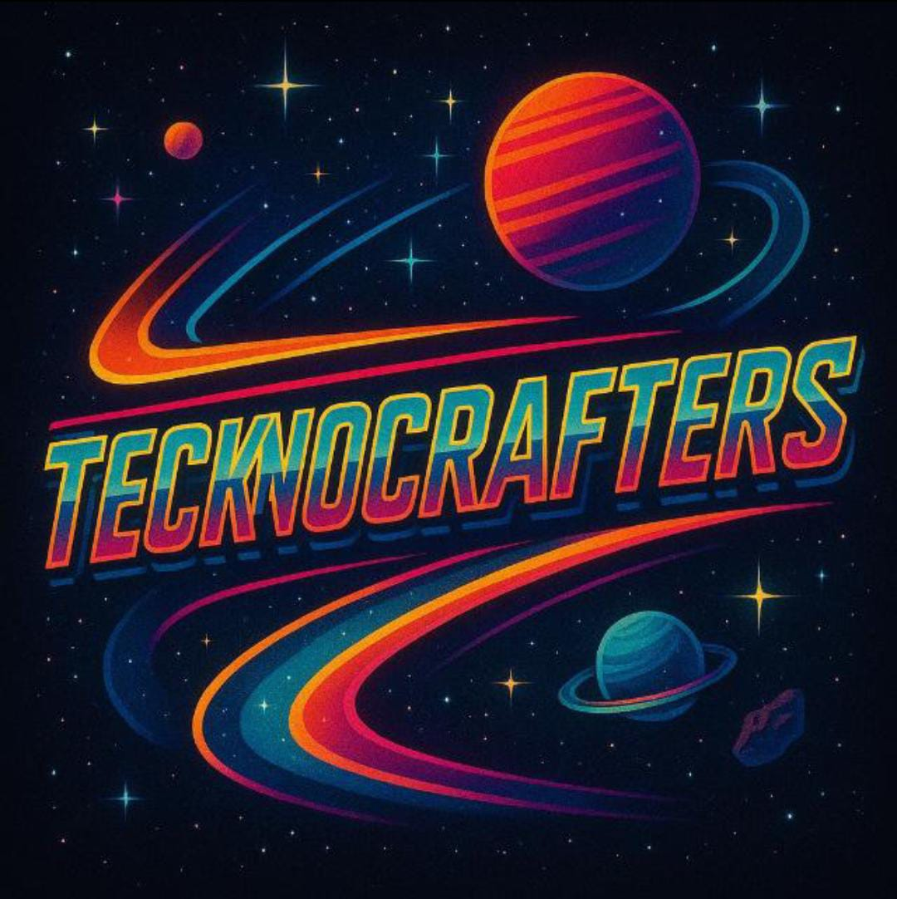

# *Tecknocrafters-Nasa-Space-App-Challenger-2025*

<!--
<p align="center">
  <video src="Assets/" width=400/>
<p/> -->

# *Team membersTeKnoCrafters:* 
    https://www.spaceappschallenge.org/2025/find-a-team/teknocrafters/

<p align="center">
  
</p>

# *Acerca del equipo:*
Esta plataforma educativa integra datos atmosféricos de NASA con metodologías de aprendizaje experiencial para desarrollar ciudadanos globales informados y científicamente alfabetizados. El sistema combina datos satelitales y terrestres con herramientas de visualización interactiva para fomentar la exploración científica y el pensamiento espacial.


# *Acerca del desafío:*
**From EarthData to Action: Cloud Computing with Earth Observation Data for Predicting Cleaner, Safer Skies**
El desafío "From EarthData to Action: Cloud Computing with Earth Observation Data for Predicting Cleaner, Safer Skies" busca utilizar datos de observación terrestre para predecir cielos más limpios y seguros mediante computación en la nube.

**Objetivo Principal:**
    -  Analizar datos atmosféricos para mejorar la predicción de calidad del aire.\
    - Utilizar infraestructura de computación en la nube para procesamiento escalable.\
    - Desarrollar modelos predictivos basados en datos satelitales y estaciones terrestres.\
    - Datos Disponibles.

  **Satélites:**

 *3. Visualización de Datos:*
    - Creación de un dashboard en PowerBI o Tableau.
    - Presentación visual de las conclusiones del análisis.
    - Exposición clara de los hallazgos del análisis exploratorio.

    
• **TEMPO:** NO2, formaldehído, índice de aerosoles, ozono.\
• **GOES y Himawari-8:** Imágenes visibles e infrarrojas.\
• **TEMPO:** NO2, formaldehído, índice de aerosoles, ozono.

**Estaciones Terrestres:**
• Proyecto Pandora (168 sites).\
• Red TOLNet (12 sites).\
• AirNow y OpenAQ.

## *Estructura Del Proyecto*
```API-paleontology/
└── node_modules/                # Modulos node.js
└── src/                         # Rutas del proyecto
|   ├─── models/                 
|   │   ├── fossil.js            # Modelo de fósil
|   │   ├── museum.js            # Modelo de museo
|   │   └── user.js              # Modelo de usuario
|   ├───routes/
|   │   ├── authRoutes.js        # Rutas de autenticación
|   │   ├── fossil.js            # Rutas de fósiles 
|   │   └── museum.js            # Rutas de museos
|   │   └── validate_token.js    # Rutas de autenticación
├─── .env/                       # Variables de entorno
├─── .gitignore/                 # Archivos y directorios ignorados
├─── README.md/                  # README repositorio GitHub
├─── index.js/                   # Index del proyecto
├─── package-lock.json/          # Dependencias del proyecto
└─── package.json/               # Dependencias del proyecto
```

## *Documentación Proyecto*
    https://docs.google.com/document/d/1uuhRDvQpKQE9btqwEHbOsw9dWNDeE0vpcwazzpXzLTM/edit?usp=sharing


Copyright: © https://github.com/0Kelly087 Create by: © 0Kelly087\
Copyright: © https://github.com/IvonneSierra Create by: © IvonneSierra\
Copyright: © https://github.com/MarianOspina Create by: © MarianOspina\
Copyright: © https://github.com/Hvnt3rK3ys Create by: © Hvnt3rK3ys\
Copyright: © https://github.com/dg2c4 Create by: © dg2c4


**https://github.com/0Kelly087/Nasa-Space-App-Challenger-2025**
