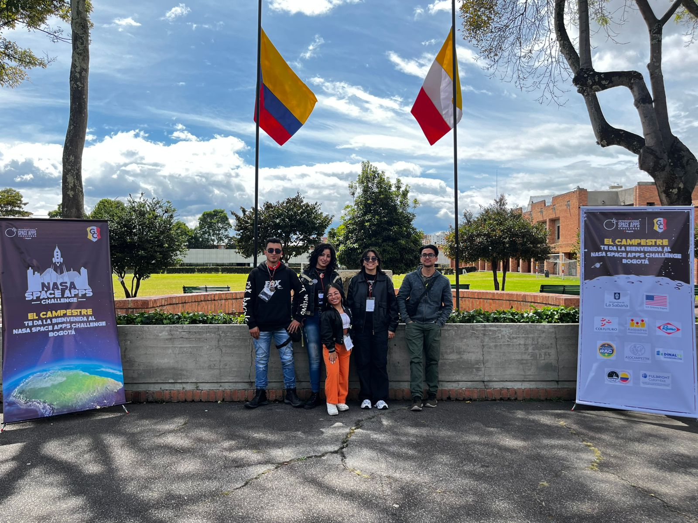

# *Tecknocrafters-Nasa-Space-App-Challenger-2025*

<p align="rigth">
  <video src="https://github.com/user-attachments/assets/aa9fb98a-9e0a-4ea3-8c59-80d6f42477ad" width=400">
<p/>

## *Demo TEemsat Website Teknocrafters Proyect*
    https://www.youtube.com/watch?v=RjIbYJguMS0

<p align="center">
  <video src="https://github.com/user-attachments/assets/18251cb2-07d7-47b0-beba-debde0f0f32d" width="400" height="350"/>
<p/>

# *Acerca del desafío:*
**From EarthData to Action: Cloud Computing with Earth Observation Data for Predicting Cleaner, Safer Skies**\
El desafío "De EarthData a la acción: Computación en la nube con datos de observación de la Tierra para predecir cielos más limpios y seguros" busca utilizar datos 
de observación terrestre para predecir cielos más limpios y seguros mediante computación en la nube.

    https://www.spaceappschallenge.org/2025/challenges/from-earthdata-to-action-cloud-computing-with-earth-observation-data-for-predicting-cleaner-safer-skies/?tab=resources

<p align="center">
  
</p>

## **Objetivo Principal:**
  - Analizar datos atmosféricos para mejorar la predicción de calidad del aire.
  - Utilizar infraestructura de computación en la nube para procesamiento escalable.
  - Desarrollar modelos predictivos basados en datos satelitales y estaciones terrestres.
  - Datos Disponibles.

## **Satélites:**
  - **TEMPO:** NO2, formaldehído, índice de aerosoles, ozono.
  - **GOES y Himawari-8:** Imágenes visibles e infrarrojas.
  - **AIRS:** Humedad relativa y temperatura superficial.

## **Estaciones Terrestres:**
  - Proyecto Pandora (168 sites).
  - Red TOLNet (12 sites).
  - AirNow y OpenAQ.

## **Datos meteorológicos:**
  - **Fuente:** OpenWeatherMap API, NOAA, WeatherKit, Meteostat.
  - **Datasets:** NASA Worldview, GOES, and Himawari Imagery, MERRA-2 Reanalysis Data, TEMPO Satellite Data.
  - **Variables:** Temperatura, humedad, viento, presión, precipitación.


# *Acerca del equipo:*
Somos un equipo de desarrolladores 👩‍💻 y matemáticos 🧮: Nos dedicamos a crear valor a través de nuestras soluciones.\
Esta plataforma educativa integra datos atmosféricos de NASA con metodologías de aprendizaje experiencial para desarrollar ciudadanos globales informados y científicamente alfabetizados.
El sistema combina datos satelitales y terrestres con herramientas de visualización interactiva para fomentar la exploración científica y el pensamiento espacial.

    https://www.spaceappschallenge.org/2025/find-a-team/teknocrafters/
  
<p align="center">
  
</p>

## *Documentación Proyecto*
    https://docs.google.com/document/d/1uuhRDvQpKQE9btqwEHbOsw9dWNDeE0vpcwazzpXzLTM/edit?usp=sharing

## *Estructura Del Proyecto*
```Tecknocrafters-Nasa-Space-App-Challenger-2025/
C:\USERS\USUARIO\NASA-SPACE-APP-CHALLENGER-2025\APPS
│   __init__.py
│
├───api
│   │   admin.py
│   │   apps.py
│   │   models.py
│   │   tests.py
│   │   urls.py
│   │   views.py
│   │   __init__.py
│   │
│   ├───migrations
│   │   │   __init__.py
│   │   │
│   │   └───__pycache__
│   │           __init__.cpython-312.pyc
│   │
│   └───__pycache__
│           admin.cpython-312.pyc
│           apps.cpython-312.pyc
│           models.cpython-312.pyc
│           urls.cpython-312.pyc
│           views.cpython-312.pyc
│           __init__.cpython-312.pyc
│
├───core
│   │   admin.py
│   │   app.py
│   │   models.py
│   │   test.py
│   │   urls.py
│   │   views.py
│   │   __init__.py
│   │
│   ├───templates
│   │   └───core
│   │           filtros.html
│   │           index.html
│   │           predicciones.html
│   │
│   └───__pycache__
│           admin.cpython-312.pyc
│           models.cpython-312.pyc
│           urls.cpython-312.pyc
│           views.cpython-312.pyc
│           __init__.cpython-312.pyc
│
├───ia_models
│   │   admin.py
│   │   apps.py
│   │   models.py
│   │   tests.py
│   │   views.py
│   │   __init__.py
│   │
│   ├───migrations
│   │   │   __init__.py
│   │   │
│   │   └───__pycache__
│   │           __init__.cpython-312.pyc
│   │
│   └───__pycache__
│           admin.cpython-312.pyc
│           apps.cpython-312.pyc
│           models.cpython-312.pyc
│           __init__.cpython-312.pyc
│
└───__pycache__
        __init__.cpython-312.pyc
```

---

# Para reproducir la pagina web:

### 1. Instalar Conda con `winget`
 Ejecuta el siguiente comando para instalar Anaconda:
   ```bash
   winget install -e --id Anaconda.Anaconda3
   ```

### 2. Crear un Entorno Conda

1. Abre una nueva terminal (puedes usar "Anaconda Prompt" o "cmd").
2. Crea un entorno de Conda para tu proyecto Django. Reemplaza `mi_entorno` con el nombre que prefieras:
   ```bash
   conda create --name mi_entorno 
   ```


### 3. Activar el Entorno Conda

1. Activa el entorno recién creado:
   ```bash
   conda activate mi_entorno
   ```
2. Verifica que el entorno esté activo. Deberías ver el nombre del entorno al inicio de la línea de comandos:
   ```bash
   (mi_entorno) C:\Users\tu_usuario>
   ```


### 4. Instalar las Dependencias del Proyecto

1. Instala las dependencias del proyecto usando `pip`:
   ```bash
   pip install -r requirements.txt
   ```

### 5. Desplegar el Proyecto en Localhost

1. Asegúrate de que el entorno de Conda esté activo y de que estás en la carpeta raíz del proyecto.
2. Ejecuta el servidor de desarrollo de Django:
   ```bash
   python manage.py runserver
   ```
3. Si todo está configurado correctamente, verás un mensaje similar a:
   ```
   Starting development server at http://127.0.0.1:8000/
   ```
4. Abre tu navegador y visita [http://127.0.0.1:8000/](http://127.0.0.1:8000/) para ver tu proyecto en acción.
---
## **Team membersTeKnoCrafters:**

Copyright: © https://github.com/0Kelly087 Created by: © 0Kelly087\
Copyright: © https://github.com/IvonneSierra Created by: © IvonneSierra\
Copyright: © https://github.com/MarianOspina Created by: © MarianOspina\
Copyright: © https://github.com/Hvnt3rK3ys Created by: © Hvnt3rK3ys\
Copyright: © https://github.com/dg2c4 Created by: © dg2c4
