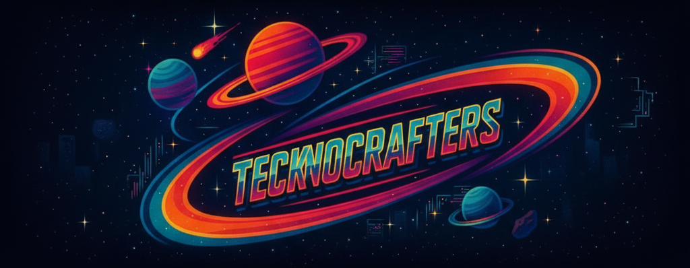

# *Tecknocrafters-Nasa-Space-App-Challenger-2025*


<!-- <p align="center">
  <video src="Assets/Ilustration-challenge.png" width=400">
<p/> -->

# *Acerca del desafío:*
**From EarthData to Action: Cloud Computing with Earth Observation Data for Predicting Cleaner, Safer Skies**\
El desafío "De EarthData a la acción: Computación en la nube con datos de observación de la Tierra para predecir cielos más limpios y seguros" busca utilizar datos 
de observación terrestre para predecir cielos más limpios y seguros mediante computación en la nube.

    https://www.spaceappschallenge.org/2025/challenges/from-earthdata-to-action-cloud-computing-with-earth-observation-data-for-predicting-cleaner-safer-skies/?tab=resources

<p align="center">
  
</p>

## **Objetivo Principal:**
  - Analizar datos atmosféricos para mejorar la predicción de calidad del aire.
  - Utilizar infraestructura de computación en la nube para procesamiento escalable.
  - Desarrollar modelos predictivos basados en datos satelitales y estaciones terrestres.
  - Datos Disponibles.

## **Satélites:**
  - **TEMPO:** NO2, formaldehído, índice de aerosoles, ozono.
  - **GOES y Himawari-8:** Imágenes visibles e infrarrojas.
  - **AIRS:** Humedad relativa y temperatura superficial.

## **Estaciones Terrestres:**
  - Proyecto Pandora (168 sites).
  - Red TOLNet (12 sites).
  - AirNow y OpenAQ.

# *Acerca del equipo:*
Somos un equipo de desarrolladores 👩‍💻 y matemáticos 🧮: Nos dedicamos a crear valor a través de nuestras soluciones.\
Esta plataforma educativa integra datos atmosféricos de NASA con metodologías de aprendizaje experiencial para desarrollar ciudadanos globales informados y científicamente alfabetizados.
El sistema combina datos satelitales y terrestres con herramientas de visualización interactiva para fomentar la exploración científica y el pensamiento espacial.

    https://www.spaceappschallenge.org/2025/find-a-team/teknocrafters/
  
<p align="center">
  
</p>

## *Documentación Proyecto*
    https://docs.google.com/document/d/1uuhRDvQpKQE9btqwEHbOsw9dWNDeE0vpcwazzpXzLTM/edit?usp=sharing

## *Estructura Del Proyecto*
```Tecknocrafters-Nasa-Space-App-Challenger-2025/
└── node_modules/                # Modulos node.js
└── src/                         # Rutas del proyecto
|   ├─── models/                 
|   │   ├── fossil.js            # Modelo de fósil
|   │   ├── museum.js            # Modelo de museo
|   │   └── user.js              # Modelo de usuario
|   ├───routes/
|   │   ├── authRoutes.js        # Rutas de autenticación
|   │   ├── fossil.js            # Rutas de fósiles 
|   │   └── museum.js            # Rutas de museos
|   │   └── validate_token.js    # Rutas de autenticación
├─── .env/                       # Variables de entorno
├─── .gitignore/                 # Archivos y directorios ignorados
├─── README.md/                  # README repositorio GitHub
├───index.html                   # Index HTML del proyecto
├─── index.js/                   # Index del proyecto
├─── package-lock.json/          # Dependencias del proyecto
└─── package.json/               # Dependencias del proyecto
```


## **Team membersTeKnoCrafters:**

Copyright: © https://github.com/0Kelly087 Created by: © 0Kelly087\
Copyright: © https://github.com/IvonneSierra Created by: © IvonneSierra\
Copyright: © https://github.com/MarianOspina Created by: © MarianOspina\
Copyright: © https://github.com/Hvnt3rK3ys Created by: © Hvnt3rK3ys\
Copyright: © https://github.com/dg2c4 Created by: © dg2c4
